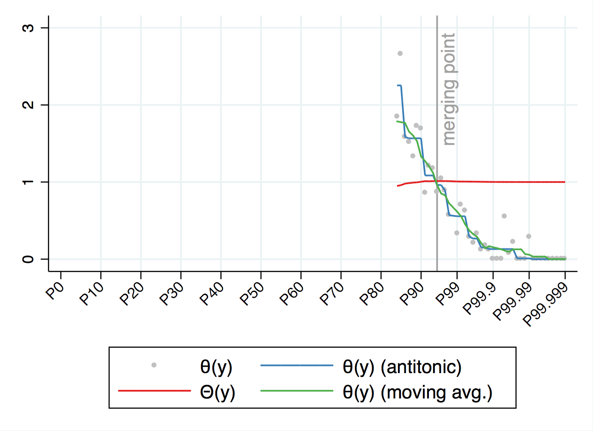
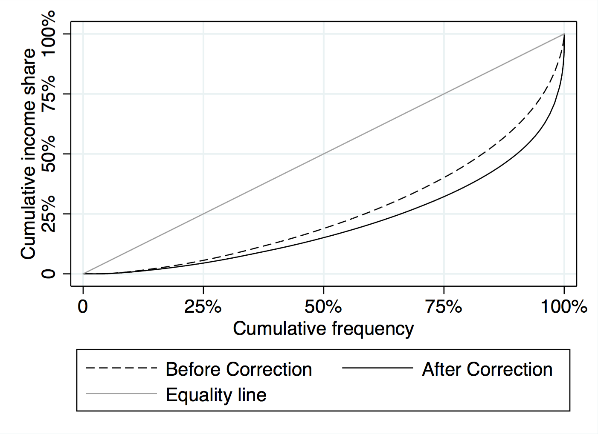

# Stata command: `bfmcorr`

Stata command for correcting survey data using tax data with the method described by Blanchet, Flores and Morgan in [“The Weight of the Rich: Improving Surveys Using Tax Data”, WID.world Working Paper 2018/12](https://wid.world/document/the-weight-of-the-rich-improving-surveys-using-tax-data-wid-world-working-paper-2018-12/).

## Installation

Users should install the package via `ssc` by typing:

```
ssc install bfmcorr
```

## Features

- Reweights observations in the survey, enforces consistency with the tax data, and replaces observations at the top of the distribution to increase precision.
- Automatically determines the "merging point" between the tax and the survey data, and extrapolates the shape of the nonresponse function if the tax data does not cover a large enough fraction of the distribution.
- Can maintain the survey's representativeness in terms of other sociodemographic variables (age, gender, etc.)
- Preserves survey microdata, including the household structure.
- Can use tax data with different statistical units (households or individuals).
- Can work with two different income variables: a comprehensive income variable assumed to drive nonresponse in the survey, and a taxable income variable that corresponds to the tax data.
- Provides several diagnostic tools to analyse the correction.

## Documentation

For technical details about the methodology, see the paper [“The Weight of the Rich: Improving Surveys Using Tax Data”, WID.world Working Paper 2018/12](https://wid.world/document/the-weight-of-the-rich-improving-surveys-using-tax-data-wid-world-working-paper-2018-12/).

For the description of the command, type `help bfmcorr`. For the description of postestimation tools, type `help postbfm`.

## Example

See the file [`example.do`](example.do) for the complete example. It showcases the method with Brazil data for 2014.

```stata
bfmcorr using "$dir_dta/gpinter-brazil-2014.csv", ///
	weight(person_weight) income(yhh) households(hid) ///
	taxu(i) trust(0.8) holdmargins(age_group male)
```
```stata
// Show the shape of the bias
postbfm biasplot
```

```stata
// Compare the Lorenz curves before and after correction
postbfm lorenz
```

